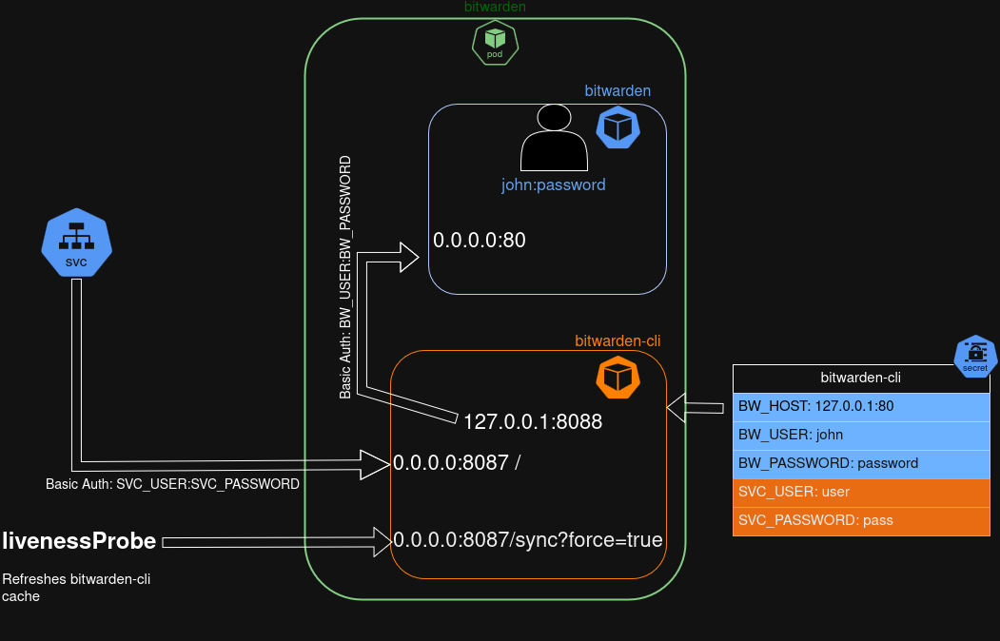

# Bitwarden-cli


[Bitwarden-cli](https://bitwarden.com/help/cli/) exposed as a web service. 
Typical use: secret withdrawal by an external-secret-operator using a specific service account. See [this guide](https://external-secrets.io/v0.18.0/examples/bitwarden/)

## Features

- Inbound Basic authentication (Nginx)
- non-root execution

supported architectures:
* arm64
* amd64

## Build locally

```shell
sudo docker build --build-arg BW_CLI_VERSION=2025.5.0 -t bitwarden/cli ./
```

## Pull from dockerhub

```shell
docker pull zar3bski/bitwarden-cli:latest
```

## Usage

### As a sidecar container



Given a **secret** named `bitwarden-cli`, the sidcar can be defined this way. Please note:

- runs as **user** 28087 
- agressive resources **limits** are possible in proportions allowed by `node`, for nginx runs with only 2 workers. 
- use `livenessProbe.sh` as **livenessProbe**. Adjust `initialDelaySeconds` according to the ressources given to this sidecar. In case of aggressive resource limitations, `bw` cli might need several minutes to configure and login 
- mount **custom CA certificates** in `/usr/local/share/ca-certificates` if needed

```yaml
        - name: bitwarden-cli
          image: zar3bski/bitwarden-cli:2025.5.0
          resources:
            requests:
              cpu: 20m
              memory: 64Mi
            limits:
              cpu: 200m
              memory: 128Mi
          imagePullPolicy: Always
          securityContext:
            runAsUser: 28087
            runAsGroup: 28087
          env:
            - name: SVC_USER
              valueFrom:
                secretKeyRef:
                  name: bitwarden-cli
                  key: SVC_USER
            - name: SVC_PASSWORD
              valueFrom:
                secretKeyRef:
                  name: bitwarden-cli
                  key: SVC_PASSWORD
            - name: BW_HOST
              valueFrom:
                secretKeyRef:
                  name: bitwarden-cli
                  key: BW_HOST
            - name: BW_USER
              valueFrom:
                secretKeyRef:
                  name: bitwarden-cli
                  key: BW_USERNAME
            - name: BW_PASSWORD
              valueFrom:
                secretKeyRef:
                  name: bitwarden-cli
                  key: BW_PASSWORD
          ports:
            - name: http
              containerPort: 8087
              protocol: TCP
          livenessProbe:
            exec:
              command:
                - /livenessProbe.sh
            initialDelaySeconds: 120
            failureThreshold: 3
            timeoutSeconds: 10
            periodSeconds: 30

```

### Variables

|              name | Description                                 | Required |
| ----------------: | :------------------------------------------ | :------: |
|         `BW_HOST` | Address or domain of the bitwarden instance |    X     |
|     `BW_CLIENTID` | (OUT) Information for Oauth                 |          |
| `BW_CLIENTSECRET` | (OUT) Information for Oauth                 |          |
|         `BW_USER` | (OUT) Information for Basic Auth            |          |
|     `BW_PASSWORD` | (OUT) Information for Basic Auth            |          |
|        `SVC_USER` | (IN) Basic auth to access **bitwarden-cli** |    X     |
|    `SVC_PASSWORD` | (IN) Basic auth to access **bitwarden-cli** |    X     |

> Depending on your **bitwarden** server configuration, you will need either to provide  `BW_CLIENTID` + `BW_CLIENTSECRET` **OR** `BW_USER` + `BW_PASSWORD`
